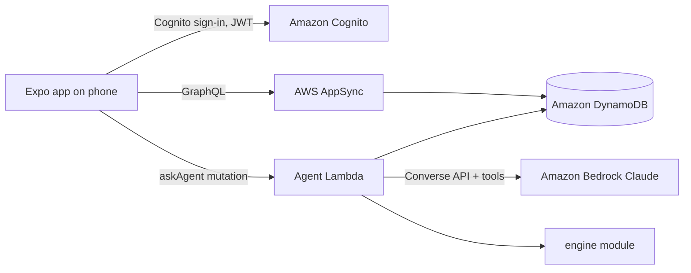

# Design Document

## Overview

**Scope note:** 24-hour build. Requirements.md "Out of scope" wins over anything in this design: no camera/Textract, no notifications, no family deductible / waiting periods / age limits / ortho, no setup wizard, no Guardrails, agent tools limited to getHousehold, estimateVisit, optimizeYear, scheduleVisit.

A mobile app built with Expo (React Native + TypeScript, Expo Router) on an AWS Amplify Gen 2 backend. All money math lives in one pure, unit-tested module, `packages/engine`, imported both by the app (instant, offline-capable estimates) and by the agent Lambda (tool calls). The Bedrock agent orchestrates; the engine calculates. This keeps every dollar figure deterministic and traceable to a plan field.

## Architecture



| Concern | Choice |
| --- | --- |
| App | Expo SDK (latest), React Native, TypeScript, Expo Router, React Native Paper (UI kit), react-native-svg (gauges), react-native-calendars (Calendar tab), @gorhom/bottom-sheet |
| Distribution | Expo Go for the live demo (QR code); EAS Update link for judges; `expo export --platform web` build on Amplify Hosting as a fallback URL |
| Auth | Amazon Cognito via `@aws-amplify/ui-react-native` Authenticator, tokens in secure storage |
| API + data | Amplify Data (AppSync + DynamoDB), `allow.owner()` rules |
| AI | Amazon Bedrock, Claude model available in the account region, Converse API with tool use |
| Tests | Vitest for the engine |

## Components and Interfaces

### App layout and screens

Bottom tab bar with three tabs: **Profile | Calendar** (Expo Router `(tabs)` layout).

| Screen (Expo Router) | Purpose |
| --- | --- |
| `app/(tabs)/profile/index` | Household: name, plan, budget, expiring-benefits banner, savings banner; member list (Mom, Dad, kids) with initial, relation, mini gauge, left to use; "Add family member" |
| `app/(tabs)/profile/[memberId]` | Member profile: gauge, next visit, care plan (add item with urgency), history, "Estimate a visit" |
| EstimateSheet (bottom sheet) | Search, per-line insurance pays / you owe / why, network toggle |
| `app/(tabs)/profile/add` | Add family member form |
| `app/(tabs)/calendar` | Month view with recommended (outlined) and scheduled (filled) visits by member color; day list; accept recommendation; "Ask" box for the scheduling agent |

Components: `HouseholdHeader`, `MemberRow`, `Gauge`, `CarePlanList`, `HistoryList`, `EstimateSheet`, `FamilyCalendar`, `DayList`, `AskBox`, `EstimateCard`, `ScheduleCard`.

State: one `useHousehold()` hook (Amplify Data subscriptions) feeds every tab; any change to TreatmentItem re-runs `optimizeYear` and refreshes recommended Visits so Profile and Calendar stay in sync.

Theme: Lincoln Financial burgundy (#650030) as primary on warm off-white surfaces; tokens and rules in `.kiro/steering/brand.md`, implemented once in `theme/colors.ts` and passed to the React Native Paper theme.


### Engine (`packages/engine`)

```ts
export type Tier = 'preventive' | 'basic' | 'major';
export type Urgency = 'urgent' | 'flexible';

export interface Plan {
  id: string; name: string; planYearStartMonth: number; // 1 = Jan
  annualMax: number; deductible: number;
  deductibleWaivedFor: Tier[];             // usually ['preventive']
  coinsIn: Record<Tier, number>;          // 1.0, 0.8, 0.5, 0.5
  coinsOut: Record<Tier, number>;
}

export interface Procedure {
  code: string; name: string; plainName: string; tier: Tier;
  feeIn: number; feeOut: number; ucr: number;
  frequency?: { count: number; perMonths: number; perTooth?: boolean };
  requiresBefore?: string[];               // e.g. D2740 after D3330 on same tooth
}

export interface MemberState {
  memberId: string; birthYear: number; enrolledOn: string;
  maxUsed: number; deductibleMet: number;
  history: { code: string; date: string; tooth?: string }[];
}

export interface LineInput { code: string; tooth?: string; inNetwork: boolean; date: string }

export interface LineResult {
  code: string; billed: number; allowed: number; deductibleApplied: number;
  insurerPays: number; memberOwes: number; warnings: string[]; explanation: string;
}

export function estimateVisit(plan: Plan, member: MemberState,
  lines: LineInput[], catalog: Map<string, Procedure>): { lines: LineResult[]; total: { insurer: number; member: number }; after: MemberState };

export interface PendingItem { id: string; memberId: string; code: string; tooth?: string; urgency: Urgency; inNetwork: boolean }

export interface ScheduleResult {
  placements: { itemId: string; month: string; memberOwes: number; reason: string }[];
  byMonth: { month: string; memberOwes: number; overBudget: boolean }[];
  totalOwed: number; baselineOwed: number; savings: number;
  nextYearMaxLeft: Record<string, number>;
}

export function optimizeYear(input: { plan: Plan; members: MemberState[]; items: PendingItem[];
  today: string; monthlyBudget: number; catalog: Map<string, Procedure> }): ScheduleResult;

export function projectedWaste(plan: Plan, members: MemberState[], today: string): { perMember: Record<string, number>; total: number; daysLeft: number };
```

### Estimate algorithm (per line, in visit order)

1. Look up procedure; if unknown, warning and skip.
2. Frequency check: count in history within perMonths (per tooth if set). If used up: insurerPays = 0, warning.
3. allowed = inNetwork ? feeIn : ucr; billed = inNetwork ? feeIn : feeOut.
4. deductibleApplied = tier in deductibleWaivedFor ? 0 : min(allowed, deductible − member.deductibleMet).
5. raw = (allowed − deductibleApplied) × coins[tier].
6. Cap: insurerPays = min(raw, annualMax − maxUsed).
7. memberOwes = billed − insurerPays. Update member state; round to cents.
8. explanation is a template string from tier, coinsurance, deductible, cap (no LLM).

### Optimizer algorithm

1. Pin urgent items to the current month.
2. For flexible items (n ≤ 10), enumerate assignments to {this year, next year} (2^n).
3. For each assignment, order items by tier, assign each to the earliest month whose running member cost stays ≤ monthlyBudget (spill to next month; urgent ignores budget), price with estimateVisit using the right year's state (next year starts with maxUsed = 0, deductibleMet = 0).
4. Score = total memberOwes across both years; tie-break by higher sum of next-year max left; then earlier dates.
5. Baseline = all items in the current month. savings = baseline − best.
6. reason per item, templated: "Moved to January: this year's max runs out; next year's fresh $1,500 covers 50%."

Acceptance test (Req 4.6): annualMax 1500, ded 50 met this year, maxUsed 600, two D2740 at $1,200 flexible → one this year (insurer 600, owe 600), one next year (insurer 575, owe 625); total owed 1225, baseline 1500, savings 275, nextYearMaxLeft 925.

### Agent Lambda

- Amplify custom mutation `askAgent(conversationId, message): AgentReply` backed by a Node Lambda.
- Loads household for the caller's Cognito `sub`; never accepts a householdId from the client.
- Bedrock Converse loop (max 6 tool turns) with tools:

| Tool | Input | Output |
| --- | --- | --- |
| getHousehold | `{ memberId? }` | members, plan summary, budget, gauges |
| estimateVisit | `{ memberId, lines[] }` | engine estimate JSON |
| optimizeYear | `{ memberIds?, extraItems? }` | engine schedule JSON |
| scheduleVisit | `{ memberId, treatmentItemId, date }` | creates or moves a scheduled Visit |

- System prompt rules: use tools for every number; never diagnose; never delay urgent items; plain language at a 6th-grade reading level; short answers; end with one suggested next step.
- Reply shape: `{ text, cards: Array<{ type: 'estimate' | 'schedule', data }> }`.

## Data Models (Amplify Data schema)

```ts
Household: a.model({ name: a.string(), monthlyBudget: a.float(), planYearStartMonth: a.integer(),
  members: a.hasMany('Member', 'householdId') }).authorization(a => [a.owner()]),
Member: a.model({ householdId: a.id(), household: a.belongsTo('Household', 'householdId'),
  firstName: a.string().required(), relation: a.enum(['self','spouse','child']), birthYear: a.integer(),
  planId: a.id(), enrolledOn: a.date(), maxUsed: a.float(), deductibleMet: a.float() })
  .authorization(a => [a.owner()]),
Plan: a.model({ name: a.string(), carrier: a.string(), rules: a.json() })   // rules = engine Plan
  .authorization(a => [a.authenticated().to(['read']), a.owner()]),
Procedure: a.model({ code: a.string().required(), name: a.string(), plainName: a.string(), tier: a.string(), data: a.json() })
  .authorization(a => [a.authenticated().to(['read'])]),
Visit: a.model({ memberId: a.id(), treatmentItemId: a.id(), date: a.date(), status: a.enum(['recommended','scheduled']), memberOwes: a.float() })
  .authorization(a => [a.owner()]),
TreatmentItem: a.model({ memberId: a.id(), code: a.string(), tooth: a.string(), urgency: a.string(),
  status: a.enum(['planned','scheduled','done']), plannedMonth: a.string(), inNetwork: a.boolean(), estimate: a.json() })
  .authorization(a => [a.owner()]),
Usage: a.model({ memberId: a.id(), date: a.date(), code: a.string(), tooth: a.string(), insurerPaid: a.float(), memberPaid: a.float() })
  .authorization(a => [a.owner()]),
```

### Seed data

- Catalog: ~30 CDT codes (D0120, D0150, D0210, D0274, D1110, D1120, D1206, D1351, D2140, D2391, D2392, D2740, D2950, D3310, D3330, D4341, D4910, D7140, D7210, D8080, D9110 …) with plain names, tiers, frequency, sample fees labeled "sample regional average".
- Plans: "Sample PPO Plus" ($1,500 max, $50 deductible, 100/80/50) and "Sample Basic" ($1,000 max, 100/70/40). Names are fictional samples.
- Demo household Rivera, budget $150/month, today = Nov 10:
  - Sam (self, 1988): maxUsed 600, deductible met, two D2740 flexible, one cleaning left.
  - Jordan (spouse, 1990): maxUsed 0, two cleanings unused.
  - Maya (child, 2014): sealants D1351 ×2 and fluoride D1206 due.
  - Leo (child, 2019): one cleaning left.
- Judge login created by the seed script; credentials go in the submission only, not the repo.

## Error Handling

- Engine never throws on user data; returns warnings. Unknown code → warning line with $0.
- Agent: Bedrock throttling → one retry with backoff, then friendly message; tool error → returned to the model as a tool error result; loop cap 6.
- All screens: skeleton loading, empty state with a primary action, error toast with retry.

## Security

- Cognito authentication; owner-based authorization on every model; Lambda derives identity from the AppSync identity, never from input.
- HTTPS only.
- Bedrock accessible only from Lambda IAM roles with least privilege; no AWS credentials in the app beyond Cognito identity; tokens kept in secure device storage.
- PII minimized: first name and birth year only.
- Bedrock does not train on customer prompts; the system prompt refuses medical advice.

## Testing Strategy

- Vitest unit tests for engine: each tier, deductible waived/applied, annual max cap, frequency limit, out-of-network balance billing, and the Req 4.6 worked example.
- Agent: 5 scripted prompts run against the deployed Lambda; check every number in the reply exists in a tool result.
- Manual demo run-through on a phone and on the projector before freeze.
